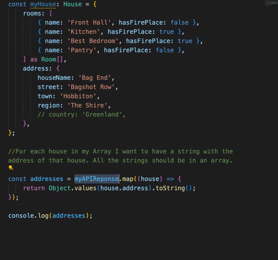

# TypeScript Game

[Markdown Cheatsheet](https://www.markdownguide.org/cheat-sheet/)

<!-- Create a working Game: The main task is to create a Game not only will this test your understanding of TypeScript but how you break down a problem.

Practice using Git and GitHub flow: We want you to get as much practice as possible using git, GitHub and the command line.

Get a better understanding of how to scope a larger project: We want to see a clear plan of what you're going to build and how.

Apply what you are learning: This is a great place to apply what you have been learning on all of the course so far. When you get it functioning really push on the UI, use SCSS, BEM, anything else you find on the web....really go mad! -->

Phraser - a single player, online guessing game inspired by Articulate.

Players will have 2 minutes to guess as many correct answers they can based on prompts given from different categories. They will have the option to receive an additional hint at the cost of a lower score. At the end of 2 minutes, they will be provided with their score and their high score will be tracked.

## HTML / SCSS
- [x] all information to be stored on a 'card' to mimic a boardgame question care
- [x] a display showing the question card
- [x] a display showing the hint
  - [x] button to accept hint
- [x] a display showing player score
- [x] an input for player answer
- [x] a display tracking players highest score
- [x] a display which shows player time remaining
- [x] a button to start timer / start game
- [ ] styling to differentiate different categories
    - [ ] include a key so players can check this / some form of header stating which category the prompt currently falls under
- [ ] accessible instructions
- [ ] styling to show if the answer is correct

### TypeScript Logic
- [x] a function that handles clicks on buttons to interact with game
    - [x] button for submit answer
    - [x] button for start game / timer
    - [x] button for 'give hint'
- [x] a function that will generate a random question
      - [x] On game start 
      - [x] On correct answer being inputted
- [x] a function that will start the game with a 120 seconds timer. This counts down and stops once time has elapsed.
    - [ ] DOM manipulation to change style to show time remaining (e.g. background gradienting to red to show time running out)
- [x] a function that keeps track of the users score based on correct answers and hints used 
    - [x] +2 for no hints
    - [x] +1 for 1 hint
- [ ] a function that stores user highscore and notifies them when this has been beaten

When the user clicks start:
- get rid of the start button

when the timer finishes:
- get rid of the question
- get rid of the hint
- get rid of the answer entering thing
- reappear the start button

- show a message in the middle showing users score

this will be useful to access everything individually as a string i.e - all values 

To Do

- remove alert on answer submission
- make a skip button
  - this may deduct points
- hint button focuses on typing
- no repeat questions
- change styling per category 